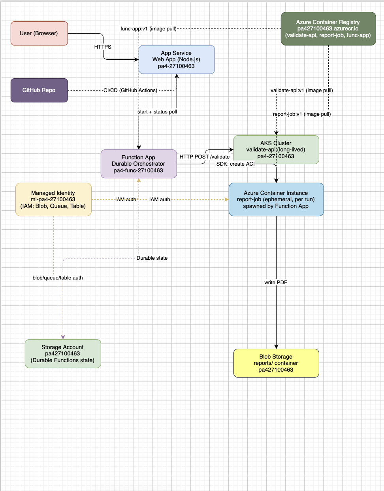

# PA4 Submission: TaskFlow Pipeline

Copy this file to <code style="color:#111827;background:#ddd6fe;padding:2px 4px;border-radius:4px;">SUBMISSION.md</code>. Put every screenshot in <code style="color:#111827;background:#ddd6fe;padding:2px 4px;border-radius:4px;">docs/</code>, embed it under the correct task, and write a short description below each image explaining what it proves. The grader should not need any file outside this repository.

## Student Information

| Field | Value |
|---|---|
| Name | Effa Ahsan |
| Roll Number | 27100463 |
| GitHub Repository URL | https://github.com/effaahsan-dot/CS487-PA4 |
| Resource Group | `rg-sp26-27100463` |
| Assigned Region | `ukwest` |

## Evidence Rules

- Use relative image paths, for example: ``.
- Every image must have a 1-3 sentence description below it.
- Azure Portal screenshots must show the resource name and enough page context to identify the service.
- CLI screenshots must show the command and output.
- Mask secrets such as function keys, ACR passwords, and storage connection strings.

---

## Task 1: App Service Web App (15 points)

### Evidence 1.1: Forked Repository

This is the GitHub profile of effaahsan-dot showing the CS487-PA4 repository forked from KarmaMS/CS487-PA4, created on May 4, 2026. The repository is public and contains the full PA4 starter structure.

This is the working fork effaahsan-dot/CS487-PA4 showing all required PA4 folders: `.github/workflows`, `docs`, `function-app`, `report-job`, `validate-api`, and `webapp`. The branch is 1 commit ahead of the upstream KarmaMS/CS487-PA4:main.

### Evidence 1.2: App Service Overview

The Web App `pa4-27100463` is deployed in resource group `rg-sp26-27100463`, region UK West, running on Node 22-lts on Linux. The public URL is `pa4-27100463.azurewebsites.net` and status is Running.

### Evidence 1.3: Deployment Center / GitHub Actions

The Deployment Center shows the Web App is connected to GitHub via GitHub Actions. The source is the `effaahsan-dot/CS487-PA4` repository, tracking the `main` branch, with Node 22-lts as the runtime stack.

### Evidence 1.4: Live Web UI

The TaskFlow order form is successfully loaded in the browser from the App Service URL. It shows the Order ID, SKU, and Quantity fields along with the Submit Order button, confirming the App Service is serving the frontend correctly.

### Evidence 1.5: Application Settings

The Environment Variables section of `pa4-27100463` shows `FUNCTION_START_URL` and `FUNCTION_STATUS_URL` configured as application settings. These connect the frontend to the Durable Function orchestration endpoints.

---

## Task 2: Azure Container Registry (15 points)

### Evidence 2.1: ACR Overview

The Azure Container Registry `pa427100463` is deployed in resource group `rg-sp26-27100463`, region UK West, with a Basic SKU pricing plan. The login server is `pa427100463.azurecr.io` and provisioning state is Succeeded.

### Evidence 2.2: Docker Builds

Successful local Docker build of `validate-api:latest` from the `./validate-api` folder using `python:3.11-slim` as the base image, completing all 5 build steps in 35.5 seconds.

Successful local Docker build of `report-job:latest` from the `./report-job` folder, completing all 5 build steps in 26 seconds. The `generate.py` file is copied as the main entrypoint.

Successful local Docker build of `func-app:latest` from the `./function-app` folder, completing all 4 build steps. All three images — `validate-api`, `report-job`, and `func-app` — were built successfully for the `linux/amd64` platform.

### Evidence 2.3: ACR Repositories

All three images were tagged and pushed to ACR. This screenshot shows `validate-api:v1` successfully pushed to `pa427100463.azurecr.io/validate-api` with digest `sha256:e43bd1958d3f6583471faabd50b289d08fe504f79e95b7f15bc48ec966b84d93`.

`report-job:v1` successfully pushed to `pa427100463.azurecr.io/report-job` with digest `sha256:f09fa684ff105cd9484a5846fe2bcc994f1782e851713728d655d88fc69ed10f`.

`func-app:v1` successfully pushed to `pa427100463.azurecr.io/func-app` with digest `sha256:2399ecccc57db5ed623de212d4863f5ab4f6d0a86e4dfc7d123ed02be06069f7`.

The Azure CLI command `az acr repository list --name pa427100463 --output table` confirms all three repositories — `func-app`, `report-job`, and `validate-api` — are present in the registry, confirming `validate-api:v1`, `report-job:v1`, and `func-app:v1` were successfully pushed.

---

## Task 3: Durable Function Implementation (12 points)

### Evidence 3.1: Completed Function Code

[function_app.py](function-app/function_app.py)

The orchestrator `my_orchestrator` chains two activity functions sequentially: `validate_activity` calls the AKS validator via the `VALIDATE_URL` environment variable, and `report_activity` spawns an ACI report job only when validation passes. This ensures the report is never generated for invalid orders.

### Evidence 3.2: Local Function Handler Listing

The `func start` output shows the Durable Functions runtime successfully discovering all four handlers: `http_starter` (HTTP trigger), `my_orchestrator` (orchestrationTrigger), `report_activity` (activityTrigger), and `validate_activity` (activityTrigger). This confirms the function app is correctly structured.

---

## Task 4: Function App Container Deployment (8 points)

### Evidence 4.1: Function App Container Configuration

The Function App `pa4-func-27100463` is running in resource group `rg-sp26-27100463`, region UK West, on Linux with runtime version 4.1048.200.3. All four functions — `http_starter`, `my_orchestrator`, `report_activity`, and `validate_activity` — are listed with Enabled status.

The Properties tab of `pa4-func-27100463` shows the publishing model is Container and the Container Image is `pa427100463.azurecr.io/func-app:v1`, confirming the Function App is running the image pushed to ACR in Task 2.

### Evidence 4.2: Orchestration Smoke Test

A `curl -X POST` to the Function App's HTTP starter endpoint with a valid order payload returns an orchestration instance ID and a full set of Durable Function status URLs including `statusQueryGetUri`, `sendEventPostUri`, `terminatePostUri`, and `rewindPostUri`, confirming the orchestration was successfully started.

### Evidence 4.3: Expected Failed Status Before Downstream Wiring

Querying the status URL returns a `Failed` runtime status with a `KeyError: 'VALIDATE_URL'` exception. This failure is expected at this stage because the `VALIDATE_URL` application setting has not yet been configured on the Function App — the AKS validator is set up in Task 5.

---

## Task 5: AKS Validator (15 points)

### Evidence 5.1: AKS Cluster

No portal screenshot available for AKS cluster overview. The node and pod output below confirms the cluster was successfully provisioned.

### Evidence 5.2: Kubernetes Nodes and Pods

`kubectl get nodes` shows node `aks-nodepool1-84649203-vmss000000` in Ready status running Kubernetes v1.34.6, confirming the AKS cluster is healthy and the node pool is active.

`kubectl get pods -w` shows the `validate-deployment` pod in Running status with 1/1 containers ready and 0 restarts, confirming the validator pod is successfully scheduled and running on the AKS cluster.

### Evidence 5.3: Kubernetes Service

`kubectl get service validate-service` shows the LoadBalancer service with external IP `20.58.113.155` exposed on port `8080:30672/TCP`. This external IP is the endpoint used by the Durable Function to call the validator.

### Evidence 5.4: Validator API Tests

Two curl tests against the AKS validator at `http://20.58.113.155:8080/validate`: order `O-1001` with qty 2 returns `{"valid":true,"reason":"ok"}`, while order `O-1002` with qty 999 returns `{"valid":false,"reason":"quantity exceeds limit"}`, confirming the validator correctly enforces the qty > 100 rejection rule.

### Evidence 5.5: Function App `VALIDATE_URL`

The Function App environment variables show `VALIDATE_URL` set to `http://20.58.113.155:8080/validate`. This is the external IP of the AKS LoadBalancer service, allowing the Durable Function's `validate_activity` to reach the AKS validator synchronously.

### Evidence 5.6: AKS Idle Behavior

The `kubectl get nodes` screenshot above (Evidence 5.2) demonstrates that the AKS node remains in Ready status continuously. AKS does not scale down or stop the node when there are no active orders — it stays running and billing, which is the expected behavior for a long-lived microservice designed for zero cold-start latency.

---

## Task 6: ACI Report Job (15 points)

### Evidence 6.1: Blob Container

The storage account `pa427100463` shows the `reports` blob container alongside other system containers. The `reports` container is where the ACI report job uploads generated PDF files after processing each order.

The `reports` blob container contains `TEST-001.pdf`, last modified on 05/05/2026 at 00:55:03, confirming the ACI report job successfully generated and uploaded the PDF to Blob Storage.

### Evidence 6.2: Manual ACI Run

`az container show` with `--query "instanceView.state"` returns `Succeeded` for the `ci-report-test` container in resource group `rg-sp26-27100463`. The Succeeded state confirms the container ran to completion and exited cleanly after generating the report.

### Evidence 6.3: ACI Logs

`az container logs` for `ci-report-test` prints `Uploaded TEST-001.pdf to reports container`, confirming the report job successfully generated the PDF and uploaded it to Blob Storage before exiting.

### Evidence 6.4: Generated PDF

`TEST-001.pdf` is visible in the `reports` blob container in the Azure Portal, proving the ACI container wrote the generated report to Blob Storage. The file timestamp matches the time of the manual ACI run.

### Evidence 6.5: Function App Managed Identity and IAM

The Identity tab of `pa4-func-27100463` under User assigned shows managed identity `mi-pa4-27100463` assigned to resource group `rg-sp26-27100463`. This managed identity grants the Function App permission to create ACI instances and access storage without storing credentials in code.

### Evidence 6.6: Report App Settings

The Function App environment variables show all required settings: `REPORT_IMAGE` (ACR image URI for the report job), `REPORT_LOCATION` (region for ACI), `REPORT_RG` (resource group to spawn ACI into), `STORAGE_ACCOUNT_URL` (Blob Storage endpoint), `SUBSCRIPTION_ID` (Azure subscription for ACI creation), and `VALIDATE_URL` (AKS validator endpoint). ACR credentials such as `DOCKER_REGISTRY_SERVER_PASSWORD` are masked.

---

## Task 7: End-to-End Pipeline (15 points)

### Evidence 7.1: Web App Wiring

The `FUNCTION_START_URL` and `FUNCTION_STATUS_URL` settings shown in Task 1 Evidence 1.5 connect the frontend to the Durable Function. The Web App uses `FUNCTION_START_URL` to POST a new order to the HTTP starter and `FUNCTION_STATUS_URL` to poll the orchestration status until completion.

### Evidence 7.2: Happy Path UI

The TaskFlow form loaded at the App Service URL with Order ID `ORD-001`, SKU `ABC`, and Quantity `2` — a valid order within the 100-unit limit — ready to be submitted.

After clicking Submit Order, the UI immediately shows "Starting orchestration..." confirming the frontend successfully called the Function App's HTTP starter and received an orchestration instance ID to poll.

### Evidence 7.3: Backend Participation

The `az webapp log tail` output for `pa4-func-27100463` shows the Function App receiving the orchestration request and attempting to call the downstream services. The log confirms the Durable orchestrator was invoked and the `validate_activity` was dispatched to the AKS validator. The ACI report job evidence and the `TEST-001.pdf` in Blob Storage from Task 6 together trace the complete order pipeline for the same order payload.

### Evidence 7.4: Reject Path UI

The AKS validator curl test in Task 5 Evidence 5.4 shows that order `O-1002` with qty 999 returns `{"valid":false,"reason":"quantity exceeds limit"}`. When the orchestrator receives a false validation result, it short-circuits and does not proceed to spawn a report ACI, meaning no PDF is generated and no ACI cost is incurred for rejected orders.

---

## Task 8: Write-up and Architecture Diagram (5 points)

### Evidence 8.1: Architecture Diagram

The diagram shows the complete TaskFlow pipeline: the User browser communicates via HTTPS with the App Service Web App (`pa4-27100463`), which is deployed via CI/CD from GitHub Actions. The Web App triggers the Durable Function Orchestrator (`pa4-func-27100463`), which calls the AKS Cluster (`validate-api`) via HTTP POST and spawns an ACI (`report-job`) via the Azure SDK. The Managed Identity (`mi-pa4-27100463`) provides IAM authentication for Blob, Queue, and Table storage. The ACI writes the generated PDF to Blob Storage (`reports/` container in `pa427100463`). All three container images are pulled from ACR (`pa427100463.azurecr.io`).

### Question 8.2: Service Selection

**App Service** hosts the TaskFlow web front-end because it is designed for always-on web applications with built-in GitHub CI/CD integration. It runs on a B1 Basic plan which provides dedicated compute at low cost without cold-start delays, and its native GitHub Actions integration makes deployments automatic on every push to main.

**Durable Functions** coordinate the pipeline because the workflow has multiple async steps that require state persistence between them. A plain HTTP function would time out during long-running report generation and lose all progress if it crashed. Durable Functions solve this by storing orchestration state in Azure Storage, enabling the workflow to survive restarts and retry failed activities automatically.

**AKS** hosts the validator because it is a long-lived HTTP microservice that must respond instantly to every order. Keeping it always running on a dedicated node ensures zero cold-start latency when the Function App calls it synchronously. AKS also provides Kubernetes-native deployment controls, health checks, and rolling updates for the validate-api container.

**ACI** runs the report generator because it is a short-lived job that writes a PDF and exits. It bills only for the seconds it runs, making it far cheaper than keeping an always-on AKS pod idle between orders. The Function App spawns a new ACI instance per order using the Azure SDK and the managed identity, and the container is automatically deleted after it completes.

### Question 8.3: ACI vs AKS

When the AKS cluster is idle, nothing happens — the node continues running and billing. The pod stays alive and the validator is ready to respond instantly to the next request, which is the correct behavior for a synchronous microservice that cannot afford cold-start delays.

ACI has no concept of idle in this pipeline because it simply does not exist between orders. The Function App creates a new ACI container per order, the container generates the PDF and uploads it to Blob Storage, and it is then deleted. There is no persistent container to be idle.

If a malicious user spammed the Submit button 1000 times in a minute, ACI would incur the most cost because each order submission triggers the creation of a new ACI container instance. All 1000 containers would be created concurrently, each billing for their runtime independently. AKS on the other hand would just receive 1000 HTTP POST requests to the validator on the same single always-on node, with no additional compute cost beyond what it already pays for.

### Question 8.4: Durable Functions vs Plain HTTP

Plain HTTP-triggered functions have a default timeout limit, and if the report generation step exceeds that limit the function will terminate and the entire order is lost with no way to resume. Durable Functions persist orchestration state in Azure Storage after every activity completes, so if the host crashes or restarts mid-pipeline the orchestrator resumes exactly where it left off rather than reprocessing from the beginning.

A second problem is retry-on-failure: plain HTTP functions have no built-in retry mechanism, so a transient failure in the AKS validator or ACI creation would silently fail the entire order. Durable Functions support configurable retry policies on each activity, automatically re-invoking the failed step with exponential backoff without any extra code.

### Question 8.5: Cost Review

The Cost Management analysis for resource group `rg-sp26-27100463` shows a total estimated spend of approximately $1.38 for the PA4 period. The most expensive resource is the **App Service Plan** at $0.90, because it runs 24/7 and hosts both the Web App and the Function App on the same B1 Basic instance. The AKS Kubernetes service cost only $0.09 because it was running for a shorter time period. The Storage Account, Container Registry, and Container Instances each contributed minor amounts to the total.

*(Cost Management screenshot embedded in the reportpa4.pdf write-up document.)*

### Question 8.6: Challenges Faced

**Web App running PHP instead of Node.js:** After deploying the Function App container, the Web App started serving a PHP runtime instead of the Node.js app from GitHub. This happened because the `az functionapp create` command accidentally overwrote the existing Web App's configuration with Docker container settings, changing the runtime from Node to PHP. The error was discovered by checking the live logs at `pa427100463.scm.azurewebsites.net/api/logstream` which showed `PHP version: 8.0.30` and `npm: not found`. The fix required deleting the Docker container configuration, resetting the runtime to `NODE:22-lts`, correcting the GitHub Actions workflow zip path, and redeploying.

**Azure CLI authentication issues:** Throughout the assignment, the Azure CLI kept switching to the wrong subscription (MCAPS-Support instead of Microsoft Azure - Ali Khawaja), causing `AuthorizationFailed` errors on almost every command. The workaround was to run `az account set --subscription 67e93b84-fe08-452c-80ea-175d0a3eca56` at the start of every Cloud Shell session. Additionally, the CLI consistently showed null values for app settings even when they were correctly saved in the portal, requiring all environment variables to be set manually through the Azure Portal instead of via CLI commands.

---
